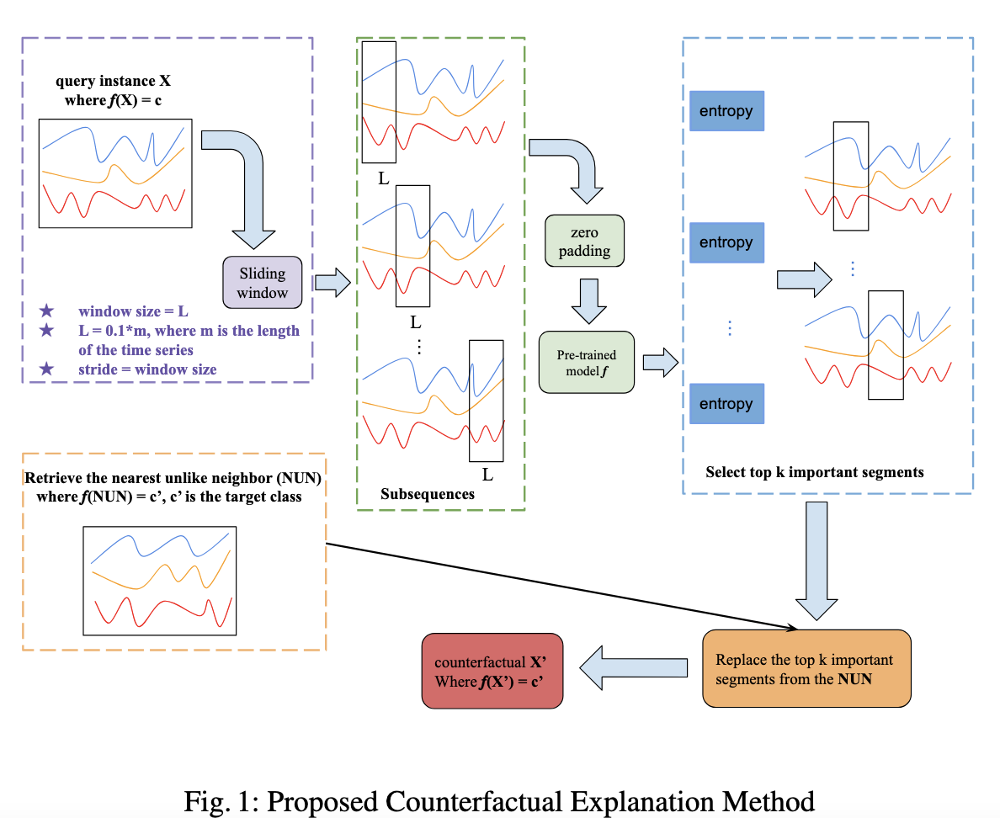

# AB-CF: Attention-based Counterfactual Explanation for Multivariate Time Series 
This is the repository for our paper titled "[Attention-Based Counterfactual Explanation for Multivariate Time Series](https://link.springer.com/chapter/10.1007/978-3-031-39831-5_26)". This paper has been accepted at the [Big Data Analytics and Knowledge Discovery 25th International Conference, DaWaK 2023](https://link.springer.com/book/10.1007/978-3-031-39831-5)
 
# Abstract
In this paper, we propose Attention-based Counterfactual Explanation (AB-CF), a novel model that generates post-hoc counterfactual explanations for multivariate time series classification that narrows the attention to a few important segments. We validated our model using seven real-world time-series datasets from the UEA repository. Our experimental results show the superiority of AB-CF in terms of validity, proximity, sparsity, contiguity, and efficiency compared with other competing state-of-the-art baselines.

# Approach
 

# Dataset
The data used in this project comes from the [UEA](https://arxiv.org/abs/1811.00075) archive.

# Prerequisites
All python packages needed are listed in [pip-requirements.txt](pip-requirements.txt) file and can be installed simply using the pip command.

# Reference
If you re-use this work, please cite:

@inproceedings{li2023attention,
  title={Attention-Based Counterfactual Explanation for Multivariate Time Series},
  author={Li, Peiyu and Bahri, Omar and Boubrahimi, Souka{\"\i}na Filali and Hamdi, Shah Muhammad},
  booktitle={International Conference on Big Data Analytics and Knowledge Discovery},
  pages={287--293},
  year={2023},
  organization={Springer}
}
